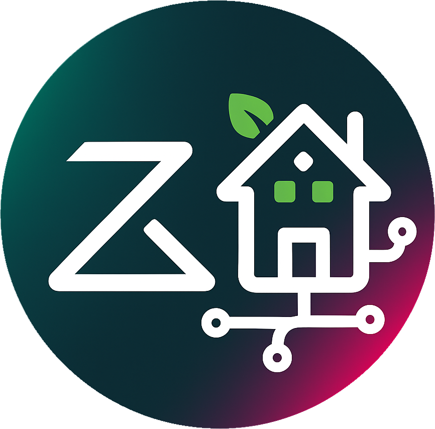
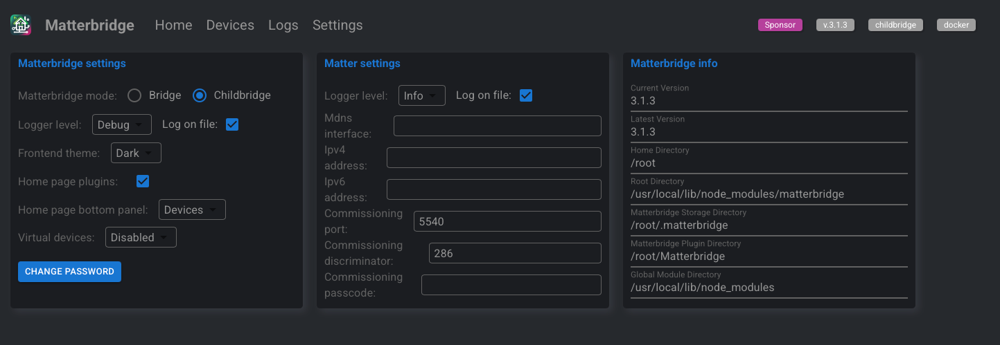
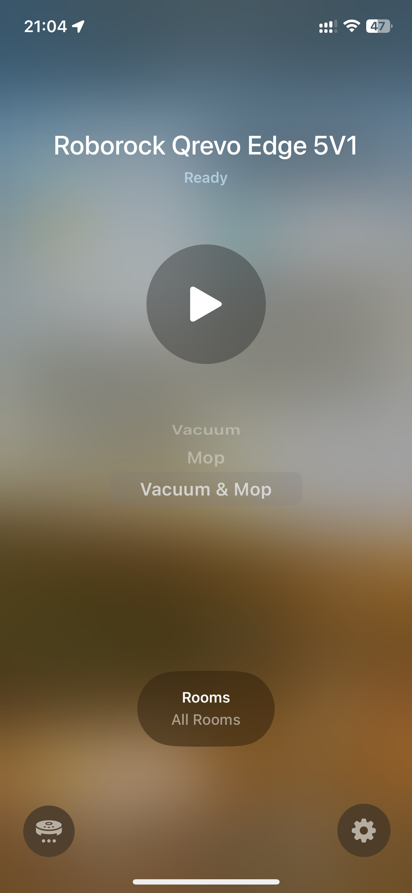
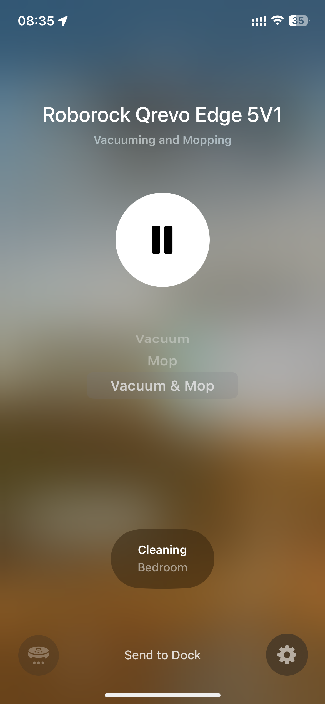
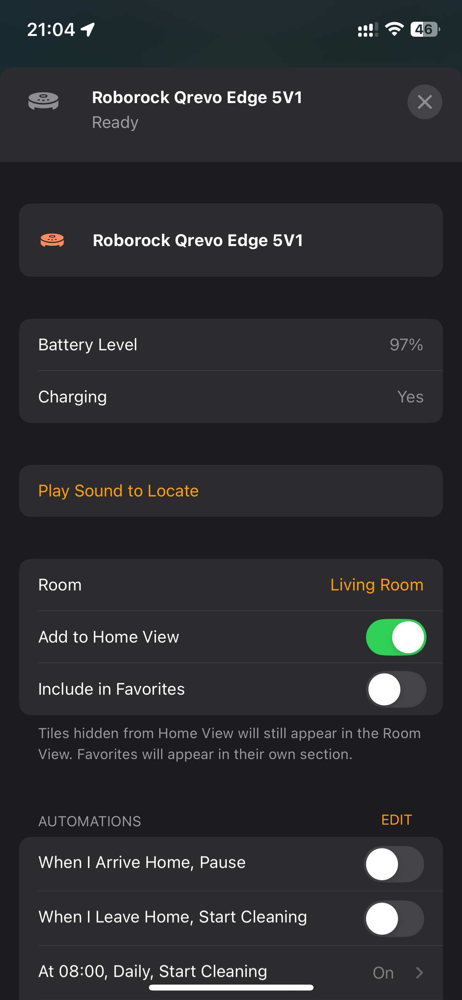
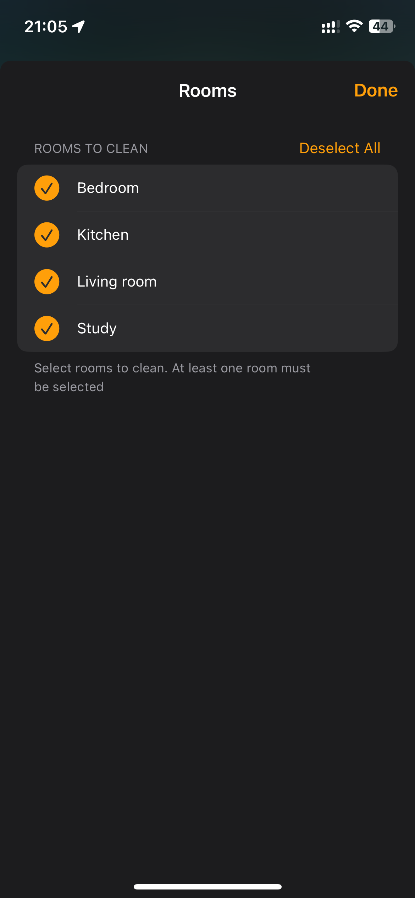
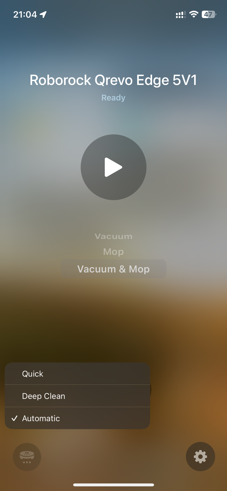

<p align="center">
  
</p>

<h1 align="center">Matterbridge Roborock Platform Plugin</h1>

<p align="center">
  <a href="https://www.npmjs.com/package/matterbridge-roborock-vacuum-plugin">
    
  </a>
  <a href="https://www.npmjs.com/package/matterbridge-roborock-vacuum-plugin">
    
  </a>
  <a href="https://github.com/RinDevJunior/matterbridge-roborock-vacuum-plugin/actions/workflows/publish.yml/badge.svg">
    
  </a>
  <a href="https://codecov.io/gh/RinDevJunior/matterbridge-roborock-vacuum-plugin">
    
  </a>
  <a href="https://www.npmjs.com/package/matterbridge">
    
  </a>
  <a href="https://www.npmjs.com/package/node-ansi-logger">
    
  </a>
</p>

---

**Matterbridge Roborock Platform Plugin** is a dynamic platform plugin for [Matterbridge](https://www.npmjs.com/package/matterbridge) that integrates Roborock vacuums into the Matter ecosystem, enabling control via Apple Home and other Matter-compatible apps.

> ⭐ If you find this project useful, please consider starring the repository on GitHub:  
> [https://github.com/RinDevJunior/matterbridge-roborock-vacuum-plugin](https://github.com/RinDevJunior/matterbridge-roborock-vacuum-plugin)

---

### ⚠️ Important Notes

Requires matterbridge@3.4.7

- **Matterbridge must be run in child bridge mode** for proper operation.
- **Use one Matterbridge instance per Roborock vacuum.**  
  If you have more than one vacuum, please run separate instances.
  Please put the <**Vacuum name**>-<**duid**> of device you want to use into **whiteList** section in the plugin configuration popup.

  More details available here: [Discussion #264](https://github.com/Luligu/matterbridge/discussions/264)

---

### 🆔 How to Get Your DUID

To get the **DUID** for your devices, you have two options:

**Option 1: From Matterbridge Logs**

1. **Start Matterbridge** with the plugin enabled.
2. **Watch the Docker console logs directly** (not the Matterbridge UI logs, as they may be truncated).
3. Look for the log message that says:
   ```text
   Initializing - devices: [...]
   ```

**Option 2: From the Roborock App**

1. Open the **Roborock app** on your phone.
2. Go to your **Device**.
3. Tap **Settings** > **Product Info**.
4. Find the **DID** field. The value will look like `rr_xxxxxxx`.
5. **Remove the `rr_` prefix** from the DID value. The remaining string is your DUID.

---

### 🚧 Project Status

- **Under active development**
- Requires **`matterbridge@3.1.7`**
- ⚠️ **Known Issue:**

* Vacuum may appear as **two devices** in Apple Home
* Error: Wrong CRC32 2241274590, expected 0 -> this is normal error and not impact to plugin functionality
* ---

### ➡️ [See Supported & Tested Roborock Devices](./README_SUPPORTED.md)

📋 **Apple Home ↔️ Roborock Clean Mode Mapping:**  
For a detailed table of how Apple Home clean modes map to Roborock settings, see 👉 [Apple Home ↔️ Roborock Clean Mode Mapping](./README_CLEANMODE.md)

---

### 📦 Prerequisites

- A working installation of [Matterbridge](https://github.com/Luligu/matterbridge)
- Compatible Roborock vacuum model (not all models supported yet)

---

### ⚙️ Matterbridge setting

<div align="center">
  
</div>

---

### 💬 Need Help?

🛠️ **Reporting an Issue**  
Before opening an issue, please make sure to read the instructions here:  
[📄 How to Report an Issue](./README_REPORT_ISSUE.md)

💬 **Community Support**  
Join our Discord for support, updates, and community discussions:  
👉 [Join the Matterbridge Roborock Discord](https://discord.gg/favqExHGn4)

---

### 🧱 Built With

This plugin is built on top of the official dynamic platform example:  
🔗 [matterbridge-example-dynamic-platform](https://github.com/Luligu/matterbridge-example-dynamic-platform)

---

### 📸 Screenshot

<p align="center">
  
  
</p>
<p align="center">
  
  
</p>
<p align="center">
  
</p>
