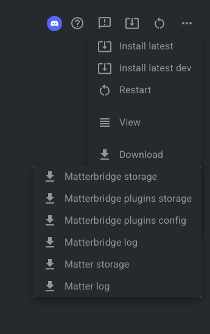

### ⚙️ Matterbridge Setup

  

> 🛠️ Follow the configuration shown above to set up Matterbridge correctly for your Roborock vacuum.

---

### 🔄 Steps to Reproduce

1. Apply the configuration shown above.  
2. Restart **Matterbridge**.  
3. Reproduce the issue you're encountering.

---

### 🪵 Collect Logs

After reproducing the issue, download the **MATTERBRIDGE LOG** file:

  

---

### 📬 Submit an Issue

Please upload the log file and describe the problem at:  
[https://github.com/RinDevJunior/matterbridge-roborock-vacuum-plugin/issues](https://github.com/RinDevJunior/matterbridge-roborock-vacuum-plugin/issues)

Your logs help me troubleshoot and improve compatibility. Thank you! 🙏