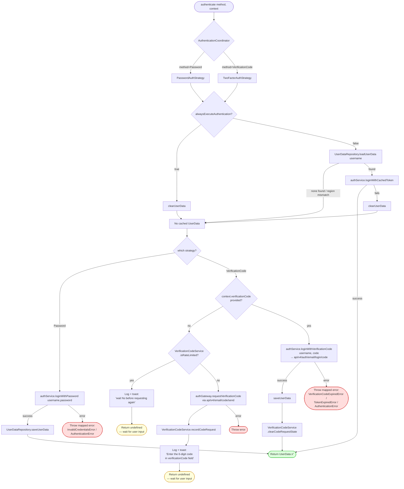

# Authentication Flow

## Key points

- `AuthenticationCoordinator` is just a dispatcher — picks `PasswordAuthStrategy` or `TwoFactorAuthStrategy` from a `Map<'Password'|'VerificationCode', IAuthStrategy>`.
- Both strategies extend `BaseAuthStrategy`, which always tries `tryAuthenticateWithCachedToken()` first (unless `alwaysExecuteAuthentication` config is set), via `UserDataRepository` (validates username+region) → `AuthenticationService.loginWithCachedToken` → `RoborockAuthGateway.refreshToken`.
- **Password path**: cache miss → `loginWithPassword` (`api/v1/login`) → save token.
- **2FA path**: cache miss → if no code yet, request one (rate-limited via `VerificationCodeService`, 15-min window) and return `undefined` so the user supplies the code via config; if code is present, `loginWithVerificationCode` (`api/v4/auth/email/login/code`) → save token + clear code-request state.
- All terminal calls funnel through `AuthenticationService`, which wraps `RoborockAuthGateway` → `RoborockAuthenticateApi`, mapping errors to `InvalidCredentialsError`, `TokenExpiredError`, `VerificationCodeExpiredError`, or generic `AuthenticationError`.
