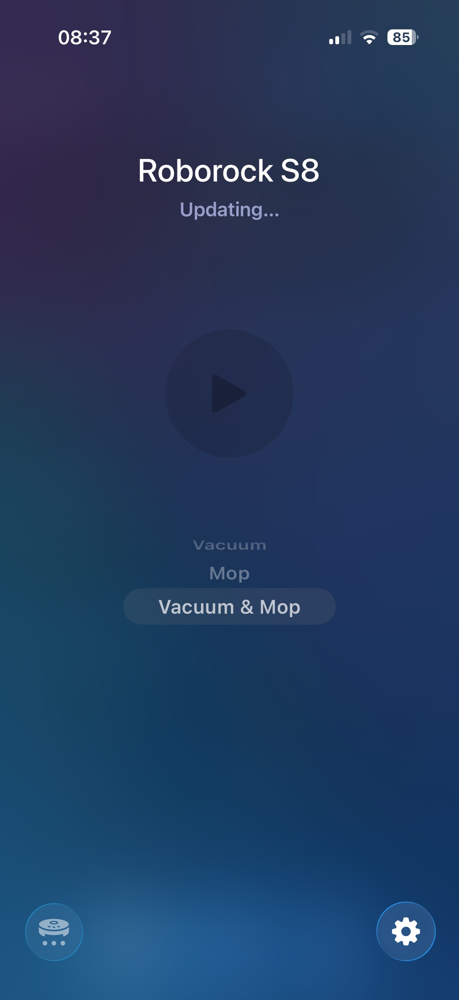
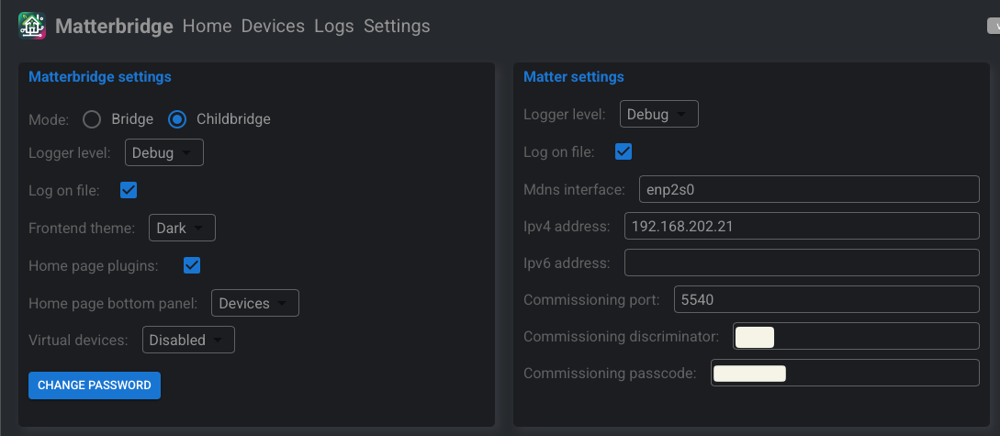

# Apple Home – Vacuum Stuck at “Updating” Issue

## 📌 Context

Some users reported a weird issue:

When opening the **Apple Home app**, the vacuum status shows:

> **"Updating…"**

And it stays there indefinitely, never becoming _Ready_.

<p align="center">
  
</p>

---

## ⚠️ Important Note

- I **cannot reproduce this issue** on my setup.
- Since I can’t reproduce it, I cannot provide a guaranteed fix.
- However, I will document my full working configuration so others can compare.

---

# 🏗 My Setup

## Matterbridge Deployment

- Running via **Docker (Portainer)**
- Network mode: `host`
- Started from version **3.0.4**
- Frequently upgraded using built-in upgrade button
- Current version: **3.5.4**

### Docker Stack

```yaml
version: '3.7'

services:
  matterbridge:
    container_name: matterbridge
    image: luligu/matterbridge:3.0.4
    network_mode: host
    restart: always
    volumes:
      - /home/rinnguyen/Data/matterbridge/Matterbridge:/root/Matterbridge
      - /home/rinnguyen/Data/matterbridge/.matterbridge:/root/.matterbridge
```

### Notes

- `network_mode: host` is required for proper mDNS behavior.
- Matterbridge is running with:
  - NodeJS 22.x
  - IPv6 NOT enabled inside Matterbridge
- Host OS: Debian 12 (Bookworm)

<p align="center">
  
  
</p>

---

# 🖥 Homelab Server

- Device: Dell OptiPlex 3050
- CPU: Intel i3-6100T
- RAM: 16GB
- OS: Debian GNU/Linux 12
- Kernel: 6.1.x
- Network: Single Ethernet interface (no WiFi)

IP Address:

```
192.168.202.21
```

---

# 🌐 Network Infrastructure

## Main Router

- TP-Link ER-605 v2

## Main Switch

- TP-Link TL-SG1024DE

## Sub Switch (Apple TV connected here)

- TP-Link TL-SG108E

## Access Point

- TP-Link Deco X60 (Access Point mode)

---

# 📺 Apple TV

- Apple TV 4K (Ethernet + WiFi version)
- Likely 3rd generation
- Connected via Ethernet
- IP: `192.168.202.32`

---

# 🌍 IPv6 Configuration

- IPv6 WAN: ❌ Disabled
- IPv6 LAN: ✅ Enabled (Link-local only)
- Prefix: `fe80::/64`
- Global IPv6: ❌ Not configured

You can verify inside container:

```bash
ip -6 addr
```

Expected:

- `fe80::` addresses present
- No global IPv6 address

---

# 📡 Multicast Status

Interface: `enp2s0`

Verified using:

```bash
ip maddr
```

Results:

- mDNS IPv4 → `224.0.0.251` ✅ joined
- mDNS IPv6 → `ff02::fb` ✅ joined
- SSDP → `239.255.255.250` ✅ joined
- Kernel multicast → Enabled

---

# 🔧 Switch Configuration

IGMP Snooping: **Enabled**

Report Message Suppression: **Disabled**

IGMP Filtering: **Not supported on this firmware**

---

# 🎯 Summary

My environment characteristics:

- Single subnet (192.168.202.x)
- No VLAN segmentation
- No Guest isolation
- Host network mode Docker
- IPv6 link-local enabled
- Multicast confirmed working
- No multicast filtering
- No WiFi isolation
- Apple TV wired

With this setup:

✅ No “Updating” stuck issue  
✅ Stable Matter connection  
✅ Immediate device status refresh

---

If you're experiencing the issue:

Compare:

- Multicast behavior
- VLAN segmentation
- WiFi isolation
- Docker network mode
- IGMP settings
- IPv6 link-local availability
